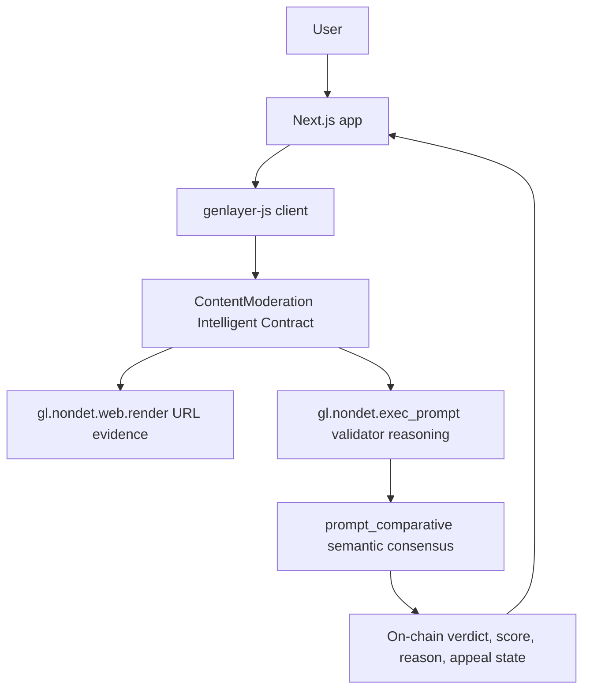

# AI-powered Content Moderation

An Intelligent Contract project for GenLayer that moderates user-submitted text or URL-based content with on-chain AI reasoning, web evidence, semantic validator consensus, and an appeal flow.

Pitch: this project dies without GenLayer because the core decision is a subjective moderation verdict that needs live web evidence, LLM reasoning, and decentralized validator agreement rather than a single private backend.

## Live Artifacts

- Live app: https://content-moderation-zeta.vercel.app/
- Contract address: `0x3CEa734cCB8d30b4d76476Da32c513892aeD13Ae`
- Explorer: https://genlayer.com/explorer?address=0x3CEa734cCB8d30b4d76476Da32c513892aeD13Ae

## Why GenLayer

Content moderation decisions can remove access, reject submissions, affect reputation, and trigger appeals. A normal web app can call one AI model off-chain, but users must trust the operator. This project puts the judgment into a GenLayer Intelligent Contract:

- `gl.nondet.web.render` fetches URL evidence on-chain for URL submissions.
- `gl.nondet.exec_prompt` asks validator LLMs to reason against immutable community guidelines.
- `gl.eq_principle.prompt_comparative` compares the meaning of validator outputs, not byte-identical JSON formatting.
- Decisions, reasons, scores, and appeals are stored on-chain for review.

## Architecture



## Contract

Main contract: `contracts/ContentModeration.py`

Core methods:

- `submit(content, content_type, submitter)`: creates a moderation request.
- `evaluate(submission_id)`: fetches evidence when needed, runs AI moderation, and stores verdict.
- `appeal(submission_id, appeal_reason)`: re-evaluates a resolved request with appeal context.
- `get_submission(submission_id)`: reads full state for one request.
- `get_submissions_by_status(status)`: lists queue entries.
- `get_stats()`: reads aggregate dashboard stats.
- `get_guidelines()`: reads the immutable moderation policy.

Supported statuses:

- `PENDING`
- `APPROVED`
- `REJECTED`
- `NEEDS_REVIEW`

## Scoring Fit

### GenLayer Fit

The project uses GenLayer for the central judgment itself. URL submissions require `web.render` evidence and LLM interpretation, which a Solidity-only contract cannot perform.

### Contract Quality

The contract avoids `strict_eq` and uses semantic comparison principles for both initial evaluations and appeals. It handles invalid IDs, already evaluated submissions, malformed AI JSON, web-render failure, and appeal limits.

### Engineering

The repo is organized at the Next.js root:

```text
app/
components/
contracts/
lib/
scripts/
tests/
```

Verification:

```bash
npm install
npm run test
npm run verify
```

### Frontend / UX

The frontend uses `genlayer-js` call encoding and wallet transactions. The main user flow is:

1. Submit text or URL content.
2. Sign the submit transaction.
3. Trigger AI evaluation.
4. View verdict, score, category scores, and reason.
5. Appeal resolved decisions when needed.

## Local Setup

```bash
npm install
cp .env.local.example .env.local
npm run dev
```

Set `.env.local`:

```env
NEXT_PUBLIC_CONTRACT_ADDRESS=0x3CEa734cCB8d30b4d76476Da32c513892aeD13Ae
NEXT_PUBLIC_NETWORK=studionet
NEXT_PUBLIC_GENLAYER_RPC_URL=https://rpc.testnet.genlayer.com
```

Open:

```text
http://localhost:3000
```

## Build

```bash
npm run build
npm run start
```

## Deploy Contract

```bash
npm run verify
npx genlayer deploy contracts/ContentModeration.py --name ContentModeration
```

After deployment, update:

- `.env.local`
- Vercel project environment variables
- `DEPLOY.md`

## Deploy Frontend

```bash
vercel --prod
```

Required Vercel environment variables:

```env
NEXT_PUBLIC_CONTRACT_ADDRESS=0x3CEa734cCB8d30b4d76476Da32c513892aeD13Ae
NEXT_PUBLIC_NETWORK=studionet
NEXT_PUBLIC_GENLAYER_RPC_URL=https://rpc.testnet.genlayer.com
```

## Demo Script

1. Open the live app.
2. Submit clean content and show an approved or low-risk result.
3. Submit risky content or a URL and show web-backed reasoning.
4. Open Review Queue.
5. Open a request detail page and show score, reason, and on-chain metadata.
6. Submit an appeal and show the appeal transaction/result.

## Known Review Notes

- The contract must be redeployed after contract changes before the live app can demonstrate the new semantic consensus and web evidence behavior.
- `genlayer-js` wallet support is still young, so the client uses SDK-compatible RLP call encoding and browser wallet transaction submission.

## License

MIT
